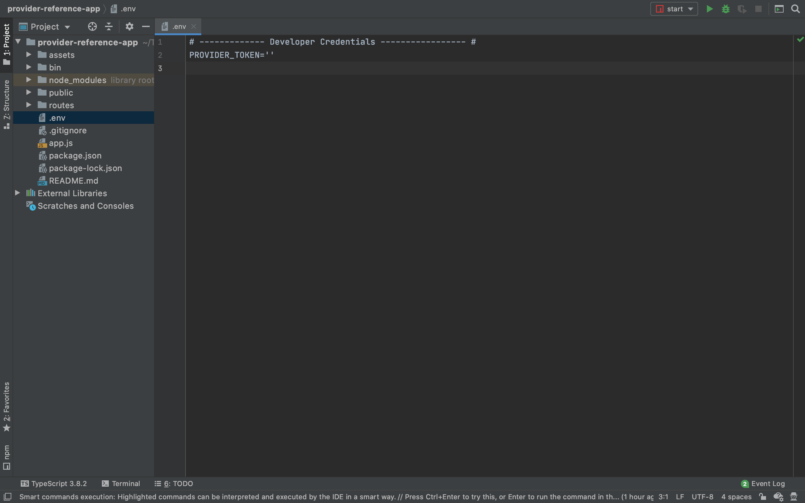
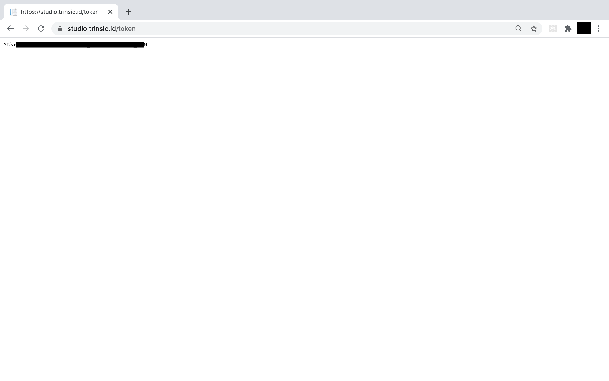
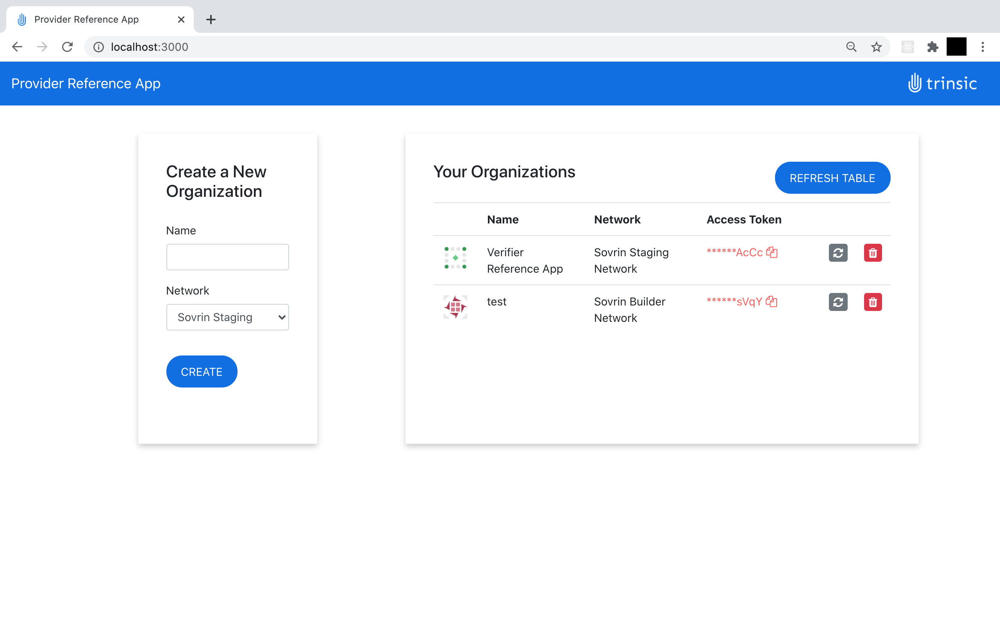

# Trinsic's Provider Reference App
This demo shows how to use Trinsic's Provider API to manage organizations under your Trinsic account.
It is a Node.js Express app which makes Trinsic Provider API calls with our service client.

## Use Case
This sample is to simulate a dashboard to manage organizations in your Trinsic Studio account.

## Prerequisites:
- [npm](https://www.npmjs.com/get-npm)

## Setup 

### Download project and install dependencies 
 1. Clone the repository
    - `git clone https://github.com/streetcred-id/provider-reference-app`
 2. Navigate into the directory
    - `cd provider-reference-app`
 3. Install the dependencies
    - `npm install`
 4. Open up the project in a code editor of your choice
 5. Rename the `.env-template` file to `.env`
 
 
### Retrieve your Provider Token
 1. Go to <a href="https://studio.trinsic.id" target="_blank">Trinsic Studio</a> and login or create an account.
 2. Visit <a href="https://studio.trinsic.id/token" target="_blank">studio.trinsic.id/token</a> and copy the string on the screen. This is a secure access token; do not lose it or share it with anyone as it provides access to manage the organizations on your account.
  
 3. In the .env file, add your organization's Provider Token to the `PROVIDER_TOKEN` field.

## Run the web app
 
### Start and use the application
1. Run with npm.
`npm start`
2. Open the web app on <a href="http://localhost:3000" target="_blank">localhost:3000</a>.

3. Enter a name for a new organization, select a network, and click **CREATE ORGANIZATION**.
    - It might take a few seconds to create the organization and refresh the table on the right.
4. Copy an organization Access Token to the clipboard by clicking on the token.
5. Assign an organization a new Access Token by clicking on its refresh button.
6. Delete an organization by clicking on its red trash button.

> Contact <support@trinsic.com> for any questions. 
